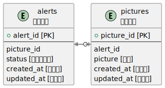

# Object Detection with YOLOv8

This project focuses on the object detection task using the [YOLOv8](https://github.com/ultralytics/ultralytics) model.

## How to Use

1. Clone this repository to your local machine.
2. Please install [CUDA](https://developer.nvidia.com/cuda-downloads).
3. Set up a virtual environment and install the required dependencies using the provided `environ/requirements.txt`.

   ```bash
   python3 -m venv yolo
   pip install -r environ/requirements.txt
   ```

4. Please execute with the following code.

   ```bash: Detection for Camera
   python3 object_detection_yolov8.py
   ```

   ```bash: Detection for Video
   python3 object_detection_yolov8.py --video <mp4 file path>
   ```

## Table Layout


